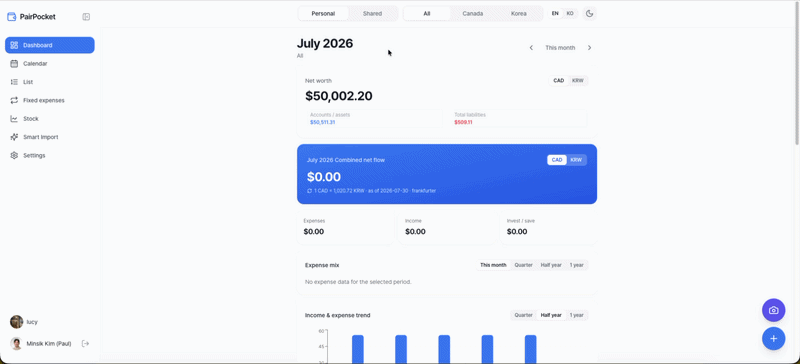
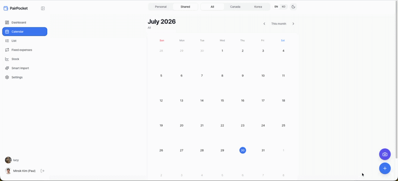
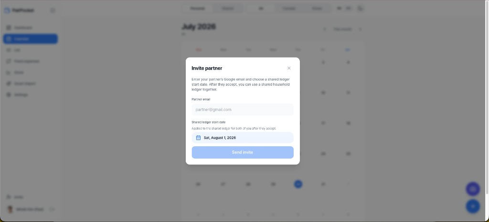
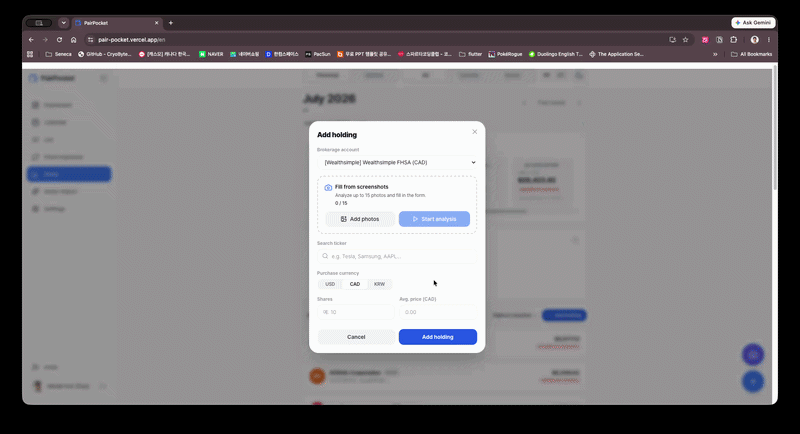

# PairPocket

[](https://pair-pocket.vercel.app/en)
[](https://buymeacoffee.com/minsikpaul92)

A dual-currency (KRW / CAD) household ledger for couples: **personal** books stay private, **shared** books stay in sync, and AI helps turn screenshots into structured data.

**Live app:** [https://pair-pocket.vercel.app/en](https://pair-pocket.vercel.app/en)

<a href="https://buymeacoffee.com/minsikpaul92" target="_blank" rel="noopener noreferrer">
  
</a>

---

## Why this exists

Immigrant couples often juggle two currencies, two countries, and a mix of “mine / yours / ours.” Spreadsheets break down once you add credit cards, subscriptions, brokerage holdings, and a partner who needs the same shared numbers.

PairPocket is a production PWA I built end-to-end (product, UI, API, auth, deploy) so two people can run that reality in one app without mixing private ledgers.

---

## Demo

### Personal ↔ Shared ledger toggle

Switch context instantly. Shared data is scoped by partnership; personal data never leaks to the partner.



### Add a transaction

Quick entry with the shared day picker and floating actions (camera for scan, plus for manual entry).



### Invite a partner

Send a Google-email invite with a **shared ledger start date** so both sides align from day one.



### AI screenshot fill (stocks / onboarding)

Upload brokerage (or onboarding) screenshots; Gemini fills structured fields so you are not retyping tickers and balances.



---

## Highlights (for reviewers)

| Area | What shipped |
|------|----------------|
| Auth | Google OAuth (Authlib) + app JWT, invite accept while logged out / logged in |
| Dual ledger | `personal` vs `shared` with group-scoped queries (`shared_group_id`) |
| Multi-currency | CAD / KRW / ALL with FX for combined views |
| Product surface | Calendar, list, dashboard analytics, subscriptions, stocks, smart import |
| AI | User-supplied Gemini key, model fallback chain, partner key borrow / share |
| Mobile | PWA, safe-area chrome, Apple HIG-inspired Tailwind UI (light / dark) |
| Deploy | Frontend on **Vercel**, API on **Heroku**, MongoDB Atlas |

Specs: [`PRD.md`](./PRD.md) · Design: [`design.md`](./design.md)

---

## Architecture

```
pair-pocket/
├── frontend/   # Next.js 15 App Router, next-intl, Tailwind, PWA
└── backend/    # FastAPI, Motor (async MongoDB), Authlib OAuth
```

| Layer    | Stack |
|----------|--------|
| Frontend | Next.js (App Router), React, Tailwind CSS, `@ducanh2912/next-pwa`, next-intl |
| Backend  | FastAPI, Pydantic, Motor |
| Data     | MongoDB Atlas |
| AI       | Google Gemini (user API key, encrypted at rest) |
| Hosting  | Vercel + Heroku |

---

## Tech Stack (detail)

Same as the table above. Local setup needs Node 18+, Python 3.11+, and a MongoDB URI.

## Getting Started

### 1. Backend (FastAPI)

```bash
cd backend
python3 -m venv .venv
source .venv/bin/activate        # Windows: .venv\Scripts\activate
pip install -r requirements.txt
cp .env.example .env             # then edit with MongoDB + Google OAuth secrets
uvicorn app.main:app --reload
```

- API docs: http://localhost:8000/docs
- Health: http://localhost:8000/

### 2. Frontend (Next.js)

```bash
cd frontend
npm install
cp .env.example .env.local       # NEXT_PUBLIC_API_BASE_URL → backend
npm run dev
```

- App: http://localhost:3000

> **PWA note:** `next-pwa` is disabled in development. For installable PWA testing: `npm run build && npm run start`.

## Environment Variables

| Location              | Variable                   | Description                                    |
| --------------------- | -------------------------- | ---------------------------------------------- |
| `backend/.env`        | `MONGODB_URI`              | MongoDB connection string                      |
| `backend/.env`        | `MONGODB_DB_NAME`          | Database name (default: `pairpocket`)          |
| `backend/.env`        | `CORS_ORIGINS`             | Comma-separated allowed frontend origins       |
| `backend/.env`        | `SECRET_KEY`               | JWT + OAuth session secret                     |
| `backend/.env`        | `GOOGLE_CLIENT_ID`         | Google OAuth 2.0 Client ID                     |
| `backend/.env`        | `GOOGLE_CLIENT_SECRET`     | Google OAuth 2.0 Client Secret                 |
| `backend/.env`        | `OAUTH_REDIRECT_URI`       | Must match the URI registered in GCP           |
| `backend/.env`        | `FRONTEND_URL`             | Post-login redirect target                     |
| `frontend/.env.local` | `NEXT_PUBLIC_API_BASE_URL` | FastAPI base URL                               |

## Google OAuth Setup (Google Cloud Console)

The login flow is backend-driven (Authorization Code Flow via Authlib).

1. Create/select a project in [Google Cloud Console](https://console.cloud.google.com/).
2. **OAuth consent screen** (External). Add test users while unpublished.
3. **Credentials → OAuth client ID** (Web application).
   - Authorized redirect URI example (local): `http://localhost:8000/api/auth/callback`
4. Copy Client ID / Secret into `backend/.env` and set:

   ```env
   OAUTH_REDIRECT_URI=http://localhost:8000/api/auth/callback
   FRONTEND_URL=http://localhost:3000
   ```

5. Generate `SECRET_KEY`:

   ```bash
   python -c "import secrets; print(secrets.token_hex(32))"
   ```

### Auth endpoints

- `GET /api/auth/login` — start Google OAuth
- `GET /api/auth/callback` — OAuth redirect (issues JWT)
- `GET /api/auth/me` — current user (`Authorization: Bearer <token>`)

## Support

If PairPocket saves you time, you can [buy me a coffee](https://buymeacoffee.com/minsikpaul92). Optional, no ads in the app.

## License

See [LICENSE](./LICENSE).
